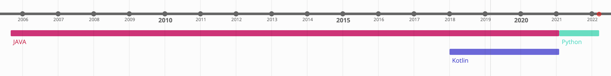
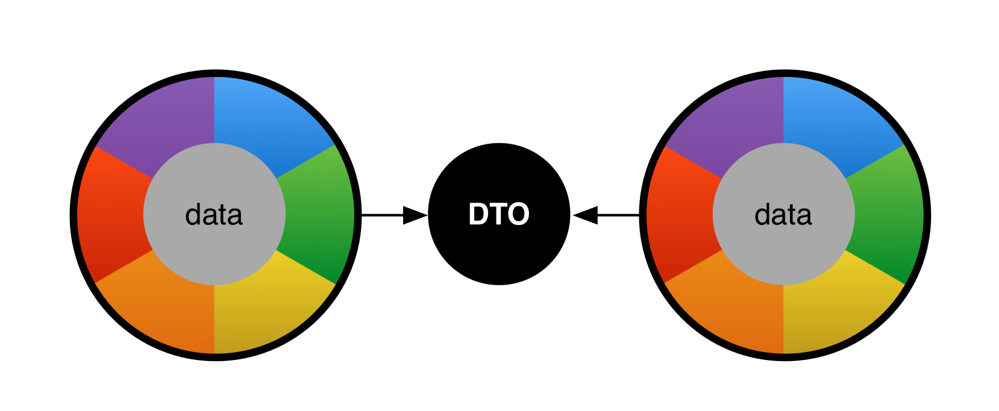

= 🌍 Records du monde 
:source-highlighter: highlightjs
:revealjs_theme: white
:revealjs_history: true
:revealjs_plugin_pdf: enabled
:revealjs_plugin_highlight: enabled
:revealjs_progress: true
:customcss: custom.css
:data-uri:
:icons: font

== World Record

== Record depuis Java 16

* JD4 14 : JEP 359 Records (Preview)
* JDK 15 : JEP 384 Records (Second Preview)
* JDK 16 : JEP 395: Records

[source, java]
----
public record MedalCount(int gold, int silver, int bronze)
----

== Des champs immutables

[source%linenums, java]
----
public record MedalCount(int gold, int silver, int bronze)

var medalCount = new MedalCount(1, 2, 3);
var gold = medalCount.gold;
var silver = medalCount.silver;
var bronze = medalCount.bronze;
----

[source%linenums, java]
----
public class MedalCount {
  private final int gold;
  private final int silver;
  private final int bronze;

  public MedalCount(int gold, int silver, int bronze) {
      this.gold = gold;
      this.silver = silver;
      this.bronze = bronze;
  }
  ....
}
----

== toString

[source, java]
----
public record MedalCount(int gold, int silver, int bronze)
----

[source%linenums, java]
----
public class MedalCount {
  private final int gold;
  private final int silver;
  private final int bronze;
  ....

  @Override
  public String toString() {
    return "MedalCount[gold=" + gold 
            + ", silver=" + silver 
            + ", bronze=" + bronze + "]";
  }
}
----

== equals / hasCode

[source, java]
----
public record MedalCount(int gold, int silver, int bronze)
----

[source%linenums, java]
----
public class MedalCount {
  private final int gold;
  private final int silver;
  private final int bronze;
  ....

  @Override
  public int hashCode() {
      return Objects.hash(gold, silver, bronze);
  }

  @Override
  public boolean equals(Object obj) {
      if (this == obj) {
          return true;
      } else if (!(obj instanceof MedalCount)) {
          return false;
      } else {
          MedalCount other = (MedalCount) obj;
          return Objects.equals(gold, other.gold)
            && Objects.equals(silver, other.silver)
            && Objects.equals(bronze, other.bronze);
      }
  }
}
----

== Benoit Prioux

icon:twitter[] icon:github[] binout 

== De Java à Python, en passant par Kotlin

== 🪱 Avant les Records, Lombok

[source%linenums, java]
----
@Data
public class MedalCount {
    private final int gold;
    private final int silver;
    private final int bronze;
}

MedalCount medalCount = new MedalCount(1, 2, 3);
int gold = medalCount.getGold();
int silver = medalCount.getSilver();
int bronze = medalCount.getBronze();
----

== 🪱 Avant les Records, Lombok

* 🔗 Dépendance nécessaire
* 🪄 Configuration Annotation Processor
* 🤯 Ouvre la porte à d'autres fonctionnalités

== 🪜 case class en Scala

[source, scala]
----
case class MedalCount(gold: Int, silver: Int, bronze: Int)
----

== 🅺 data class en Kotlin

[source, kotlin]
----
data class MedalCount(gold: Int, silver: Int, bronze: Int)
----

== 🐍 @dataclass en Python

[source, python]
----
@dataclass(Frozen=True)
class MedalCount:
  gold: int
  silver: int
  bronze: int
----

== Oui mais pourquoi faire ?

== 🔀 Data Transfer Objects

* Objet de transport de donnée pour faciliter la sérialisation/désérialisation
* Facilité d'écriture avec les records

== 🔑 Clé dans une map

* Les records comme clé composée pour une map

[source%linenums, java]
----
var countryPerMedals = 
        new HashMap<MedalCount, List<String>>();
countryPerMedals.put(
        new MedalCount(5, 2, 1), asList("us", "cn"));
countryPerMedals.put(
        new MedalCount(1, 1, 1), asList("fr", "de"));
----

== 📍 Local records

[source%linenums, java]
----
public List<String> sortCountryByMedal(List<String> countries) {

  record Data(String country, MedalCount medalCount){}

  return countries.stream()
        .map(country -> 
                new Data(country, getMedalCount(country)))
        .sorted(Comparator.comparing(d -> d.medalCount))
        .map(Data::country)
        .collect(toList());
}
----

== 😱 Primitive Obsession - Problème 

* Utilisation de types primitifs pour modéliser des "petits" objets 

[source%linenums, java]
----
public MedalCount getMedalCount(String country, 
                                String olympicGame, 
                                String sport) {
  ....
}

var medalCount = getMedalCount("FR", "14", "swimming"); ✅
var medalCount = getMedalCount("14", "FR", "swimming"); 🤯
----

== 💡 Primitive Obsession - Record ! 

* `Identifier Type` pattern

[source%linenums, java]
----
public record CountryCode(String value)
public record OlympicGameId(String value)
public record SportName(String value)

public MedalCount getMedalCount(CountryCode countryCode, 
                                OlympicGameId olympicGameId, 
                                SportName sportName) {
  ....
}

var medalCount = getMedalCount(CountryCode("FR"), 
                               OlympicGameId("14"), 
                               SportName("swimming"));
----

== ✅ Validation des données

* Validation post contruction pour assurer des invariants métier

[source%linenums, java]
----
public record MedalCount(int gold, int silver, int bronze) {

  public MedalCount {
    if (gold < 0 || silver < 0 || bronze < 0) {
      throw new IllegalArgumentException(
        "Medal count should be positive")
    }
  }
}
----

== Domain Driven Design

image::images/ddd.png[]

== Entity vs Value Object

* `Entity`: objet métier avec une identité et un cycle de vie
* `Value Object`: objet métier immutable et défini par ses attributs

[quote]
====
🎉 Les records, solution idéale pour modéliser les Value Objects ! 🎉
====

== Et si on ajoutait des méthodes ?

TODO

== En route vers les monoides ?

TODO

== Pour quels problèmes ?

TODO

== Exemple 

TODO

== Et après ? Le pattern matching ! 

TODO

== JEP 405 : Record Patterns (Preview)

https://openjdk.java.net/jeps/405

[source%linenums, java]
----
record Point(int x, int y) {}

void printSum(Object o) {
    if (o instanceof Point(int x, int y)) {
        System.out.println(x+y);
    }
}
----

== Pour conclure

TODO

