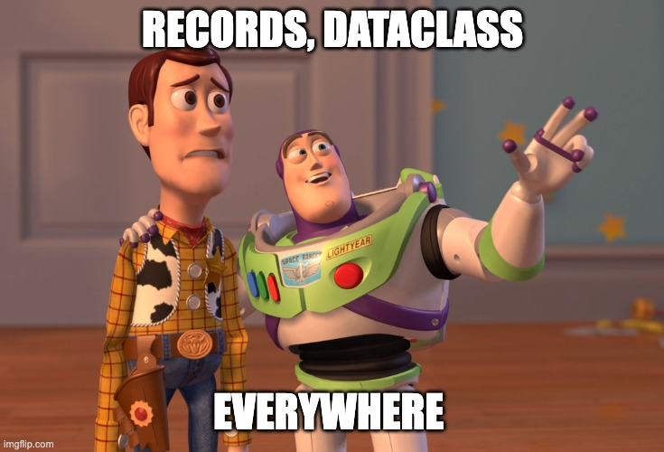

= 🏅 Records du monde 🌍
:source-highlighter: highlightjs
:revealjs_theme: white
:revealjs_history: true
:revealjs_plugin_pdf: enabled
:revealjs_plugin_highlight: enabled
:revealjs_progress: true
:customcss: custom.css
:data-uri:
:icons: font

Tour d’horizon et cas d’utilisation des records

++++

@binout

++++

== World Record

image::images/{conf}-background.png[background, size=cover]

image::images/guinness.jpeg[width=70%]

== Record depuis Java 16

image::images/{conf}-background.png[background, size=cover]

* 03/2020 - JDK 14 : JEP 359 Records (Preview)
* 09/2020 - JDK 15 : JEP 384 Records (Second Preview)
* ⭐️ 03/2021 - JDK 16 : JEP 395: Records
* 09/2021 - JDK 17 (LTS)

[source, java]
----
public record MedalCount(int gold, int silver, int bronze)
----

== Des champs immutables

image::images/{conf}-background.png[background, size=cover]

[source%linenums, java]
----
public record MedalCount(int gold, int silver, int bronze)

var medalCount = new MedalCount(1, 2, 3);
var gold = medalCount.gold;
var silver = medalCount.silver;
var bronze = medalCount.bronze;
----

[source%linenums, java]
----
public class MedalCount {
  private final int gold;
  private final int silver;
  private final int bronze;

  public MedalCount(int gold, int silver, int bronze) {
      this.gold = gold;
      this.silver = silver;
      this.bronze = bronze;
  }
  ....
}
----

== toString

image::images/{conf}-background.png[background, size=cover]

[source, java]
----
public record MedalCount(int gold, int silver, int bronze)
----

[source%linenums, java]
----
public class MedalCount {
  private final int gold;
  private final int silver;
  private final int bronze;
  ....

  @Override
  public String toString() {
    return "MedalCount[gold=" + gold 
            + ", silver=" + silver 
            + ", bronze=" + bronze + "]";
  }
}
----

== equals / hashCode

image::images/{conf}-background.png[background, size=cover]

[source, java]
----
public record MedalCount(int gold, int silver, int bronze)
----

[source%linenums, java]
----
public class MedalCount {
  private final int gold;
  private final int silver;
  private final int bronze;
  ....

  @Override
  public int hashCode() {
      return Objects.hash(gold, silver, bronze);
  }

  @Override
  public boolean equals(Object obj) {
      if (this == obj) {
          return true;
      } else if (!(obj instanceof MedalCount)) {
          return false;
      } else {
          MedalCount other = (MedalCount) obj;
          return Objects.equals(gold, other.gold)
            && Objects.equals(silver, other.silver)
            && Objects.equals(bronze, other.bronze);
      }
  }
}
----

== Benoit Prioux

image::images/{conf}-background.png[background, size=cover]

icon:twitter[] icon:github[] binout 

image::images/alan-eng.jpeg[]

== De Java à Python, en passant par Kotlin

image::images/{conf}-background.png[background, size=cover]

== 🪱 Avant les Records, Lombok

image::images/{conf}-background.png[background, size=cover]

[source%linenums, java]
----
@Data
public class MedalCount {
    private final int gold;
    private final int silver;
    private final int bronze;
}

MedalCount medalCount = new MedalCount(1, 2, 3);
int gold = medalCount.getGold();
int silver = medalCount.getSilver();
int bronze = medalCount.getBronze();
----

== 🪱 Avant les Records, Lombok

image::images/{conf}-background.png[background, size=cover]

* 🔗 Dépendance nécessaire
* 🪄 Configuration Annotation Processor
* 🤯 Ouvre la porte à d'autres fonctionnalités

== 🪜 case class en Scala

image::images/{conf}-background.png[background, size=cover]

[source, scala]
----
case class MedalCount(gold: Int, silver: Int, bronze: Int)
----

== 🅺 data class en Kotlin

image::images/{conf}-background.png[background, size=cover]

[source, kotlin]
----
data class MedalCount(gold: Int, silver: Int, bronze: Int)
----

== 🐍 @dataclass en Python

image::images/{conf}-background.png[background, size=cover]

[source, python]
----
@dataclass(Frozen=True)
class MedalCount:
  gold: int
  silver: int
  bronze: int
----

== Oui mais pourquoi faire ?

image::images/{conf}-background.png[background, size=cover]

image::images/record-why.png[]

== 🔀 Data Transfer Objects

image::images/{conf}-background.png[background, size=cover]

* Objet de transport de donnée pour faciliter la sérialisation/désérialisation
* Facilité d'écriture avec les records

////
== 🔑 Clé dans une map

image::images/{conf}-background.png[background, size=cover]

* Les records comme clé composée pour une map

[source%linenums, java]
----
var countryPerMedals = 
        new HashMap<MedalCount, List<String>>();
countryPerMedals.put(
        new MedalCount(5, 2, 1), asList("us", "cn"));
countryPerMedals.put(
        new MedalCount(1, 1, 1), asList("fr", "de"));
----

== 📍 Local records

image::images/{conf}-background.png[background, size=cover]

[source%linenums, java]
----
public List<String> sortCountryByMedal(List<String> countries) {

  record Data(String country, MedalCount medalCount){}

  return countries.stream()
        .map(country -> 
                new Data(country, getMedalCount(country)))
        .sorted(Comparator.comparing(d -> d.medalCount))
        .map(Data::country)
        .collect(toList());
}
----
////

== 😱 Primitive Obsession - Problème 

image::images/{conf}-background.png[background, size=cover]

* Utilisation de types primitifs pour modéliser des "petits" objets 

[source%linenums, java]
----
public MedalCount getMedalCount(String country, 
                                String olympicGame, 
                                String sport) {
  ....
}

var medalCount = getMedalCount("FR", "14", "swimming"); ✅
var medalCount = getMedalCount("14", "FR", "swimming"); 🤯
----

== 💡 Primitive Obsession - Record ! 

image::images/{conf}-background.png[background, size=cover]

* `Identifier Type` pattern

[source%linenums, java]
----
public record CountryCode(String value)
public record OlympicGameId(String value)
public record SportName(String value)

public MedalCount getMedalCount(CountryCode countryCode, 
                                OlympicGameId olympicGameId, 
                                SportName sportName) {
  ....
}

var medalCount = getMedalCount(CountryCode("FR"), 
                               OlympicGameId("14"), 
                               SportName("swimming"));
----

== ✅ Validation des données

image::images/{conf}-background.png[background, size=cover]

* Validation post contruction pour assurer des invariants métier

[source%linenums, java]
----
public record MedalCount(int gold, int silver, int bronze) {

  public MedalCount {
    if (gold < 0 || silver < 0 || bronze < 0) {
      throw new IllegalArgumentException(
        "Medal count should be positive")
    }
  }
}
----

== Domain Driven Design

image::images/{conf}-background.png[background, size=cover]

== Entity vs Value Object

image::images/{conf}-background.png[background, size=cover]

* `Entity`: objet métier avec une identité et un cycle de vie
* `Value Object`: objet métier immutable et défini par ses attributs

[quote]
====
🎉 Les records, solution idéale pour modéliser les Value Objects ! 🎉
====

== Exemple - Value Object

image::images/{conf}-background.png[background, size=cover]

[source%linenums, java]
----
public record MedalCount(int gold, int silver, int bronze) 
              implements Comparable<MedalCount> {

  public MedalCount {
    if (gold < 0 || silver < 0 || bronze < 0) {
      throw new IllegalArgumentException(
        "Medal count should be positive")
    }
  }

  public int total() {
      return gold + silver + bronze;
  }

  @Override
  public int compareTo(MedalCount medalCount) {
      return Comparator.comparing(MedalCount::gold)
              .thenComparing(MedalCount::silver)
              .thenComparing(MedalCount::bronze)
              .compare(this, medalCount);
  }
}
----

== Encore d'autres méthodes !

image::images/{conf}-background.png[background, size=cover]

[source%linenums, java]
----
public record MedalCount(int gold, int silver, int bronze) {

  public MedalCount add(MedalCount medalCount) {
      return new MedalCount(
              gold + medalCount.gold,
              silver + medalCount.silver,
              bronze + medalCount.bronze);
  }

}
----

== Vous avez reconnu le Monoid 🙈

image::images/{conf}-background.png[background, size=cover]

[source%linenums, java]
----
public record MedalCount(int gold, int silver, int bronze) {

  /* Binary Operator */
  public MedalCount add(MedalCount medalCount) {
      return new MedalCount(
              gold + medalCount.gold,
              silver + medalCount.silver,
              bronze + medalCount.bronze());
  }

  /* Neutral Element */
  public static MedalCount NEUTRAL_ELEMENT 
                      = new MedalCount(0, 0, 0);
}
----

== Vous avez reconnu le Monoid 🙈

image::images/{conf}-background.png[background, size=cover]

[source%linenums, java]
----
var count1 = new MedalCount(5, 2, 1);
var count2 = count1.add(NEUTRAL_ELEMENT); 
print(count1.equals(count2)) /* true */

/* Associativity */
var count3 = new MedalCount(1, 3, 0);

var countLeft  = count1.add(count2.add(count3)) 
var countRight = (count1.add(count2)).add(count3)
print(countLeft.equals(countRight)) /* true */
----

== Monoid : DDD + FP 

image::images/{conf}-background.png[background, size=cover]

https://www.youtube.com/watch?v=_jr8E5GVnBA[Les monoïdes démystifiés, en Java et avec des verres de bière](Devoxx 2015
- Cyrill Martraire)

== Merci 🙏

image::images/{conf}-background.png[background, size=cover]

https://binout.github.io/world-record/

